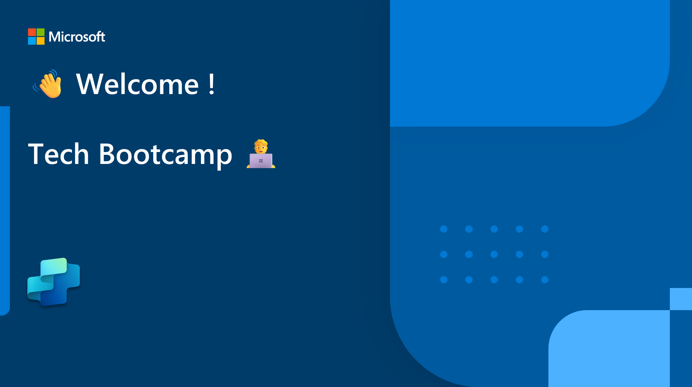
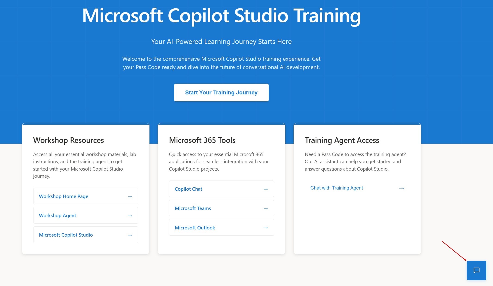

# 🥳Welcome to Microsoft Copilot Studio Paris Workshop 🐓

## VOS URL

- Microsoft Copilot Studio Training : https://aka.ms/MCSWorkshopAgent
  
- La liste de workshop : https://aka.ms/MCSWorkshopAgent/Paris 👇

## **Labs are available on GitHub 4 Paris** 

| LAB #     | TITLE                                                        | URL                                                          | OVERVIEW                                                     |
| --------- | ------------------------------------------------------------ | ------------------------------------------------------------ | ------------------------------------------------------------ |
| **01.a**  | Create your own web-based AI assistant with agent builder    | [agent-builder-web](https://github.com/microsoft/mcs-labs/tree/main/labs/agent-builder-web) | In this lab, you'll create a Copilot agent in Microsoft 365 Copilot Chat with Microsoft Copilot Studio agent builder. This agent will be designed to assist users with questions about Copilot agents. The agent will act as a learning companion or teacher, grounded in official Microsoft documentation. |
| **01.b**  | Create your own enterprise data-based AI assistant with agent builder | [agent-builder-sharepoint](https://github.com/microsoft/mcs-labs/blob/main/labs/agent-builder-sharepoint) | In this lab, you'll create a SharePoint-integrated AI assistant using Microsoft Copilot Studio agent builder. Designed to support sales operations, the agent can analyze Excel data from SharePoint, reference policy documents, and deliver insights through dynamic charts and images. Leveraging advanced capabilities like code interpreter and image generation, the Sales Admin Assistant transforms static content into interactive, intelligent responses—making sales trend tracking and policy compliance faster and easier. |
| **02**    | Set yourself up for success & discover ALM best practices    | [setup-for-success](https://github.com/microsoft/mcs-labs/tree/main/labs/setup-for-success) | Set yourself up for success by learning ALM best practices in Microsoft Copilot Studio—because building great agents isn't enough if you can't deploy, update, or collaborate with confidence. This lab shows you how to avoid common pitfalls like manual rework, overwritten changes, and fragile deployments by structuring your solutions, managing configurations, and enabling Git-based source control from the start. |
| **Ex-p1** | Create Your First Agent in Microsoft Copilot Studio          | standard-orchestrator                                        | After completing this lab, participants will be able to create their first agent in Microsoft Copilot Studio, manually author topics, test the bot, and publish it for external testing. Participants will learn the fundamentals of Copilot Studio including topic creation, message and question nodes, testing, and deployment. |
| **03.a**  | Give your public website chatbot a brain and make it an agent | [public-website-agent](https://github.com/microsoft/mcs-labs/tree/main/labs/public-website-agent) | In just 25 minutes, learn how to build and publish a Copilot Studio agent that delivers rich, contextual answers by combining your content with real-time data—no coding required. This lab guides you through creating a branded assistant that handles multi-part questions, reflects your organization's tone, reduces support load, and can be deployed to a public demo website for instant testing and feedback. |
| **04**    | Create an 'Ask me anything' agent for your employees         | [ask-me-anything](https://github.com/microsoft/mcs-labs/tree/main/labs/ask-me-anything) | In this hands-on lab, you'll build a multi-agent IT Support solution using Microsoft Copilot Studio. Your primary "Ask me anything" agent will intelligently route queries to specialized sub-agents—like one for ServiceNow knowledge and incidents—delivering fast, accurate answers across systems like SharePoint, ServiceNow, and custom sources. You'll configure contextual routing, deploy into Microsoft 365 Copilot, and streamline workflows with AI-driven analysis and human-in-the-loop review. |
| **05.b**  | Build an Autonomous Account News Assistant Agent             | [autonomous-account-news](https://github.com/microsoft/mcs-labs/tree/main/labs/autonomous-account-news) | In this hands-on lab, you'll build an autonomous Account News Assistant agent using Microsoft Copilot Studio to keep sellers informed with timely insights. The agent scans Salesforce on a recurring schedule for high-value opportunities, searches the web for related industry news, and uses Deep Reasoning to evaluate relevance. It then compiles curated summaries into a structured HTML report and sends it via Microsoft 365 Outlook—all without user interaction. By the end of the 60-minute lab, participants will have configured triggers, tools, topics, variables, and report templates to create a fully operational, proactive assistant that enhances account intelligence and helps sales teams stay ahead of key developments. |